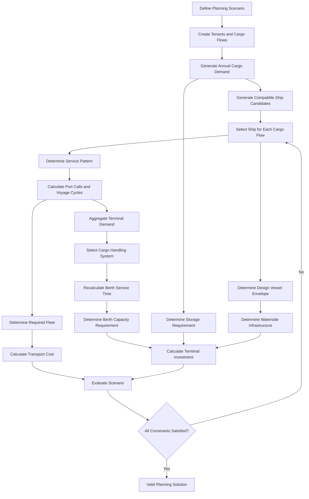

# DOMAIN MODEL
## Sistem Perencanaan Transportasi Laut dan Terminal

## 1. Tujuan Sistem

Sistem ini adalah Decision Support System (DSS) untuk merencanakan sistem transportasi laut terintegrasi antara:

1. kebutuhan muatan tenant,
2. pemilihan kapal,
3. operasi pelayaran,
4. kebutuhan armada,
5. kebutuhan terminal dan alat bongkar muat,
6. kebutuhan fasilitas daratan,
7. kebutuhan fasilitas perairan,
8. biaya transportasi dan investasi.

Sistem harus melihat seluruh komponen sebagai satu rantai keputusan.

Perubahan pada demand dapat memengaruhi:
- frekuensi kapal,
- jumlah kunjungan kapal,
- kebutuhan jumlah kapal,
- kebutuhan tambatan,
- kebutuhan alat bongkar muat,
- kebutuhan storage,
- dan total biaya.

Karena itu, modul-modul sistem tidak boleh diperlakukan sebagai kalkulator yang berdiri sendiri.

---

# 2. Konsep Domain Utama

## 2.1 Planning Scenario

`PlanningScenario` adalah root object dari seluruh perencanaan.

Satu scenario mendefinisikan:
- lokasi kawasan industri/terminal,
- periode perencanaan,
- tahun dasar,
- tenant yang dilayani,
- cargo flow,
- alternatif kapal,
- alternatif alat bongkar muat,
- kondisi terminal,
- kondisi fasilitas perairan,
- parameter biaya,
- dan asumsi teknis.

```text
PlanningScenario
├── PlanningPeriod
├── Tenant[]
├── CargoFlow[]
├── Port[]
├── Route[]
├── ShipCandidate[]
├── HandlingEquipmentCandidate[]
├── TerminalConfiguration
├── EconomicParameters
└── PlanningResult
```

Semua hasil perhitungan harus dapat ditelusuri kembali ke satu `PlanningScenario`.

---

## Scenario Parameters

Setiap scenario memiliki parameter perhitungan sendiri.

Parameter tidak boleh selalu di-hardcode sebagai bagian dari:
- commodity master data;
- calculation engine;
- source code.

Contoh parameter yang dapat berbeda antar-scenario:

- cargo conversion factor;
- growth rate;
- maximum demand;
- dwell time;
- utilization factor;
- discount rate;
- fuel price;
- exchange rate;
- maximum BOR;
- infrastructure unit cost.

Conceptual model:

Scenario
├── Scenario Inputs
├── Scenario Parameters
├── Candidate Decisions
├── Selected Decisions
└── Calculation Results

Contoh:

ScenarioParameter
- id
- scenario_id
- parameter_code
- scope_type
- scope_id
- value
- unit
- source
- is_user_editable
- description

Contoh record:

parameter_code: OUTBOUND_CONVERSION_FACTOR
scope_type: CARGO_FLOW
scope_id: FLOW_JI_HSD_OUT
value: 0.55
unit: RATIO

Scenario lain dapat menggunakan:

value: 0.60

tanpa mengubah master commodity atau source code.

Calculation engine harus membaca parameter dari scenario yang sedang dihitung.

# 3. Aggregate dan Entity

## 3.1 Tenant

Tenant adalah perusahaan atau industri yang menghasilkan kebutuhan transportasi.

```text
Tenant
├── id
├── name
├── industryType
├── operationStartYear
└── cargoFlows[]
```

Tenant bukan muatan.

Satu tenant dapat memiliki lebih dari satu `CargoFlow`, misalnya:
- inbound bahan baku,
- outbound produk hasil produksi.

---

## 3.2 CargoFlow

`CargoFlow` adalah objek utama yang merepresentasikan kebutuhan perpindahan satu komoditas.

```text
CargoFlow
├── id
├── tenant
├── direction
├── commodity
├── cargoType
├── originPort
├── destinationPort
├── startYear
├── demandProfile
├── conversionRule
└── route
```

### Direction

```text
INBOUND
OUTBOUND
```

### Cargo Type

```text
LIQUID_BULK
DRY_BULK
CONTAINER
GENERAL_CARGO
```

Cargo type menentukan:
- kapal yang kompatibel,
- alat bongkar muat yang kompatibel,
- jenis terminal,
- jenis storage,
- satuan demand,
- dan metode perhitungan fasilitas.

Contoh:

```text
CargoFlow:
Tenant      = PT Jasa Indo
Direction   = INBOUND
Commodity   = HSD
CargoType   = LIQUID_BULK
Origin      = Arab Saudi
Destination = KEK
```

---

## 3.3 Demand Profile

`DemandProfile` menyimpan perkembangan demand selama planning horizon.

```text
DemandProfile
├── initialVolume
├── maximumVolume
├── growthRate
├── startYear
├── unit
└── annualDemand[]
```

Demand hanya aktif setelah `startYear`.

Sebelum tahun operasi:

```text
annualDemand = 0
```

Setelah aktif, demand tumbuh sampai batas maksimum.

Demand tidak boleh melebihi `maximumVolume`.

---

## 3.4 Cargo Conversion Rule

Outbound dapat merupakan hasil pengolahan inbound.

Hubungan ini dimodelkan sebagai:

```text
CargoConversionRule
├── sourceCargoFlow
├── targetCargoFlow
├── conversionFactor
├── sourceUnit
└── targetUnit
```

Contoh:

```text
Inbound HSD
    ↓ 55%
Outbound HSD
```

atau:

```text
1 TEU Aluminium
    ↓ conversion factor
2 TEU Baja Ringan
```

Dengan demikian, outbound demand dapat bersifat:

```text
INDEPENDENT
```

atau:

```text
DERIVED_FROM_INBOUND
```

Sistem tidak boleh memproyeksikan derived outbound secara independen apabila secara bisnis volumenya berasal dari inbound.

---

# 4. Port dan Route Domain

## 4.1 Port

```text
Port
├── id
├── name
├── portType
├── location
├── terminalCapabilities[]
├── cargoHandlingProductivity[]
├── depth
└── portTariff
```

Port dapat berperan sebagai:
- origin,
- destination,
- atau central industrial terminal.

Port harus kompatibel dengan:
- cargo type,
- ship type,
- draft kapal,
- dan kebutuhan operasi.

---

## 4.2 Route

```text
Route
├── originPort
├── destinationPort
├── sailingDistance
└── distanceUnit
```

Satu `CargoFlow` memiliki satu rute utama.

Route menghubungkan:

```text
CargoFlow
    ↓
Origin Port
    ↓
Sailing Route
    ↓
Destination Port
```

Distance adalah karakteristik route, bukan karakteristik kapal.

---

# 5. Ship Domain

## 5.1 Ship Candidate

`ShipCandidate` adalah kapal alternatif yang dapat dipilih.

```text
ShipCandidate
├── id
├── name
├── shipType
├── payload
├── dwt
├── gt
├── loa
├── breadth
├── draft
├── serviceSpeed
├── mainEnginePower
├── auxiliaryEnginePower
├── fuelCharacteristics
└── timeCharterRate
```

Ship type harus kompatibel dengan cargo type.

Contoh compatibility:

```text
LIQUID_BULK   → TANKER
DRY_BULK      → BULK_CARRIER
CONTAINER     → CONTAINER_SHIP
GENERAL_CARGO → GENERAL_CARGO_SHIP
```

---

## 5.2 Ship Assignment

`ShipAssignment` adalah keputusan bahwa satu kapal dipilih untuk melayani satu cargo flow.

```text
ShipAssignment
├── cargoFlow
├── selectedShip
├── year
└── selectionStatus
```

Secara konseptual:

```text
CargoFlow 1 ───── 1 Selected Ship
```

untuk setiap periode keputusan.

Kapal kandidat yang tidak kompatibel tidak boleh menjadi kandidat keputusan.

---

# 6. Service Pattern

Setelah kapal dipilih, sistem membentuk pola layanan transportasi.

```text
ServicePattern
├── cargoFlow
├── selectedShip
├── annualDemand
├── effectivePayload
├── serviceFrequency
├── cargoPerCall
├── voyageCycle
└── requiredFleet
```

## Makna bisnis

`ServiceFrequency` menunjukkan berapa kali pelayanan harus dilakukan untuk memenuhi demand.

`CargoPerCall` menunjukkan muatan aktual yang dibawa dalam satu call.

`VoyageCycle` menunjukkan waktu yang dibutuhkan kapal untuk menyelesaikan satu siklus pelayanan.

`RequiredFleet` menunjukkan jumlah kapal yang diperlukan agar pola pelayanan tersebut dapat dijalankan.

Konsep-konsep tersebut berbeda dan tidak boleh digabungkan.

```text
Demand
   │
   ▼
Required Transport Service
   │
   ├── Ship Capacity ──► Service Frequency
   │
   └── Route + Port Operation ──► Voyage Cycle
                                      │
                                      ▼
                                Fleet Requirement
```

---

# 7. Voyage Cycle

`VoyageCycle` merepresentasikan satu siklus operasi kapal.

```text
VoyageCycle
├── sailingOperation
├── originPortOperation
├── destinationPortOperation
└── roundTripDuration
```

Secara bisnis:

```text
Voyage Cycle
=
Time at Sea
+
Time at Origin Port
+
Time at Destination Port
```

Port operation dapat mencakup:
- loading,
- unloading,
- waiting,
- maneuvering,
- berthing-related time.

Tidak semua komponen harus selalu aktif.

---

# 8. Port Call

Setiap kunjungan kapal direpresentasikan sebagai `PortCall`.

```text
PortCall
├── cargoFlow
├── ship
├── port
├── cargoQuantity
├── operationType
├── handlingSystem
└── berthTime
```

Operation type:

```text
LOAD
UNLOAD
```

Inbound dan outbound harus memiliki arah operasi yang benar.

Contoh:

```text
INBOUND:

Origin Port
    LOAD
      ↓
Central Terminal
    UNLOAD
```

```text
OUTBOUND:

Central Terminal
    LOAD
      ↓
Destination Port
    UNLOAD
```

Kesalahan arah loading/unloading akan menyebabkan kesalahan:
- port time,
- berth occupancy,
- handling cost,
- dan kebutuhan alat.

---

## Bathymetry and Port Water Depth Domain

### Purpose

Bathymetry represents the relationship between:

```text
distance from shoreline
```

and:

```text
available water depth
```

for a port development location.

Bathymetry is not only descriptive port data.

It is an active engineering input that connects:

```text
Ship Selection
        ↓
Selected Ship Draft
        ↓
Required Water Depth
        ↓
Bathymetry Profile
        ↓
Required Distance from Shore
        ↓
Port Development Requirement
        ↓
Trestle or Dredging Cost
        ↓
Total System Cost
```

Therefore, bathymetry must be represented explicitly in the domain model.

---

### BathymetryProfile

Represents one bathymetric profile associated with a port or port development location.

```text
BathymetryProfile
```

Suggested properties:

```text
id

port_id

name

description

distance_reference

depth_reference

calculation_method

is_active
```

Example:

```text
name:
Main Terminal Bathymetry

distance_reference:
SHORELINE

depth_reference:
CHART_DATUM

calculation_method:
LINEAR_INTERPOLATION
```

Supported calculation methods may include:

```text
LINEAR_INTERPOLATION

LINEAR_REGRESSION

PIECEWISE_LINEAR

REFERENCE_FORMULA
```

For the K21 reference scenario:

```text
calculation_method:
LINEAR_REGRESSION
```

must be available if required to reproduce the original reference calculation.

---

### BathymetryPoint

Represents one measured or assumed point in a bathymetry profile.

```text
BathymetryPoint
```

Suggested properties:

```text
id

bathymetry_profile_id

sequence

distance_from_shore_m

water_depth_m
```

Example:

| Distance from Shore | Water Depth |
|---:|---:|
| 10 m | 5 m |
| 20 m | 6 m |
| 25 m | 7 m |

Relationship:

```text
Port
    │
    └── BathymetryProfile
            │
            ├── BathymetryPoint
            ├── BathymetryPoint
            ├── BathymetryPoint
            └── BathymetryPoint
```

A port may have more than one bathymetry profile if:

```text
different terminal locations

different shoreline references

different development corridors

different survey datasets
```

However, one scenario must explicitly identify which profile is used for each terminal development calculation.

---

### WaterDepthRequirement

Represents the required navigational or berthing depth generated by the governing vessel.

This is normally a calculated value rather than independent master data.

Conceptually:

```text
WaterDepthRequirement
```

contains:

```text
governing_ship_id

governing_draft_m

depth_margin_method

depth_margin_value

required_water_depth_m
```

The required water depth is derived from:

```text
Selected Ship
        ↓
Ship Draft
        ↓
Applicable Depth Rule
        ↓
Required Water Depth
```

The governing ship may be different for different:

```text
terminal

berth

cargo category

planning period
```

---

### Governing Vessel

A terminal may serve multiple cargo flows and multiple selected ships.

The infrastructure requirement must therefore not necessarily use the draft of one arbitrary ship.

The governing vessel is the selected feasible vessel that creates the controlling infrastructure requirement.

For depth:

```text
Governing Draft
=
Maximum Applicable Draft
among selected ships served by the terminal
```

Conceptually:

```text
Selected Ships
    │
    ├── Ship A — Draft 8.0 m
    ├── Ship B — Draft 11.5 m
    └── Ship C — Draft 13.8 m
                │
                ▼
        Governing Draft
            13.8 m
```

The exact governing rule must follow the terminal configuration and business rules.

Ships assigned to unrelated terminals must not affect each other's governing draft.

---

### PortDevelopmentAlternative

Represents a technically feasible method for providing access between:

```text
shoreline
```

and:

```text
required navigable water depth
```

Initial development modes:

```text
TRESTLE

DREDGING
```

The development alternative is not independent from ship selection.

Its engineering requirement depends on:

```text
Selected Ship
        ↓
Governing Draft
        ↓
Required Water Depth
        ↓
Bathymetry Profile
        ↓
Required Development Geometry
```

Therefore:

```text
PortDevelopmentAlternative
```

must be evaluated using the current scenario decisions.

---

### TrestleDevelopment

Represents the trestle consequence of reaching sufficient natural water depth.

Conceptual inputs:

```text
required_water_depth_m

bathymetry_profile

required_distance_from_shore_m

trestle_width_m

unit_cost
```

Conceptual outputs:

```text
trestle_length_m

trestle_area_m2

trestle_cost
```

The required trestle length is not a fixed property of the port.

It may change when:

```text
selected ship changes
```

because:

```text
selected ship
→ draft
→ required depth
→ required offshore distance
→ trestle length
```

---

### DredgingDevelopment

Represents the dredging consequence required to provide sufficient water depth.

Conceptual inputs:

```text
existing bathymetry

required water depth

dredging geometry

dredging width

dredging length

unit dredging cost
```

Conceptual outputs:

```text
dredging_volume_m3

dredging_cost
```

The dredging requirement is not a fixed property of the port.

It depends on:

```text
required depth

existing bathymetry

development geometry
```

---

### Core Domain Interaction

The primary interaction is:

```text
Cargo Demand
        ↓
Ship Candidate Set
        ↓
Selected Ship
        │
        ├───────────────→ Shipping Cost
        │
        ▼
Ship Draft
        ↓
Governing Draft
        ↓
Required Water Depth
        ↓
Bathymetry Profile
        ↓
Required Development Geometry
        │
        ├───────────────┐
        ▼               ▼
Trestle Alternative   Dredging Alternative
        │               │
        ▼               ▼
Trestle Cost          Dredging Cost
        │               │
        └───────┬───────┘
                ▼
        Port Development Cost
                │
                ▼
          Total System Cost
```

This interaction is fundamental to the application.

Ship selection and port infrastructure development must not be modeled as independent planning problems.

---

### Domain Invariant

The following invariant must always hold:

```text
Every selected ship
must be physically serviceable
by the resulting port development configuration.
```

Therefore:

```text
Available or Developed Water Depth
>=
Required Water Depth
```

A solution with:

```text
lower shipping cost
```

is invalid if:

```text
the selected ship cannot safely access the terminal.
```

# 9. Cargo Handling Domain

## 9.1 Handling Equipment

```text
HandlingEquipment
├── id
├── name
├── supportedCargoTypes[]
├── productivity
├── purchaseCost
└── operationalCharacteristics
```

Alat bongkar muat hanya boleh digunakan jika kompatibel dengan cargo type.

---

## 9.2 Handling Assignment

```text
HandlingAssignment
├── cargoFlow
├── terminal
├── selectedEquipment
├── productivity
└── requiredQuantity
```

Hubungan utamanya:

```text
Cargo Type
    ↓
Compatible Equipment
    ↓
Selected Equipment
    ↓
Handling Productivity
    ↓
Berth Time
    ↓
Berth Occupancy
```

Artinya, pemilihan alat bongkar muat bukan hanya keputusan investasi.

Produktivitas alat secara langsung memengaruhi kebutuhan kapasitas terminal.

---

# 10. Berth Capacity Domain

Terminal dibagi berdasarkan compatibility pelayanan.

Contoh:

```text
Liquid Bulk Cargo
    ↓
Liquid Bulk Berth

Container
Dry Bulk
General Cargo
    ↓
Multipurpose Berth
```

Model ini harus configurable karena pengelompokan terminal dapat berbeda pada scenario lain.

---

## 10.1 Berth Demand

```text
BerthDemand
├── terminalGroup
├── year
├── portCalls[]
├── totalOccupiedTime
└── requiredCapacity
```

Semua port call yang menggunakan kelompok tambatan yang sama harus mengonsumsi resource yang sama.

```text
PortCall A ─┐
PortCall B ─┼──► Multipurpose Berth Capacity
PortCall C ─┘
```

---

## 10.2 Berth Capacity

```text
BerthCapacity
├── berthGroup
├── nominalBerthCount
├── effectiveBerthCapacity
├── availableOperatingTime
├── occupancy
└── maximumAllowedOccupancy
```

Nominal berth dan effective berth tidak selalu identik.

Sistem harus membedakan:

```text
Physical Berth Count
```

dan:

```text
Effective Service Capacity
```

---

# 11. Storage Domain

Storage requirement berasal dari cargo throughput, bukan dari jumlah kapal secara langsung.

```text
Annual Cargo Flow
        ↓
Storage Policy
        ↓
Dwelling Time
        ↓
Required Storage Capacity
```

Jenis storage ditentukan oleh cargo type.

```text
CONTAINER
    → Container Yard

GENERAL_CARGO
    → Warehouse

DRY_BULK
    → Silo
    atau
    → Open Storage

LIQUID_BULK
    → Tank Storage
```

---

## 11.1 Storage Requirement

```text
StorageRequirement
├── cargoFlow
├── storageType
├── year
├── throughput
├── dwellingTime
├── utilizationLimit
└── requiredCapacity
```

Storage untuk cargo yang berbeda tidak boleh otomatis digabungkan.

Penggabungan hanya boleh dilakukan jika:
- menggunakan fasilitas yang sama,
- komoditas kompatibel,
- dan business rule mengizinkan sharing capacity.

---

# 12. Container Yard Domain

Container flow perlu dibedakan berdasarkan status logistik.

```text
ContainerFlow
├── domestic
├── export
└── empty
```

Container yard dapat terdiri dari:

```text
ContainerYard
├── Domestic Yard
├── Export Yard
└── Empty Container Yard
```

Ground slot adalah kapasitas dasar penyimpanan.

Stacking tier meningkatkan kapasitas vertikal, tetapi dibatasi oleh:
- alat,
- operational policy,
- dan utilization limit.

---

# 13. Waterside Infrastructure Domain

Fasilitas perairan didesain berdasarkan `Design Vessel`.

Design vessel bukan selalu satu kapal yang sama untuk seluruh fasilitas.

Contoh:

```text
Maximum Breadth
    → Navigation Channel Width

Maximum Draft
    → Navigation Channel Depth

Maximum LOA
    → Turning Basin
    → Stopping Distance
    → Anchorage Area

Maximum LOA Liquid Bulk Ship
    → Liquid Bulk Berth Geometry

Maximum LOA Multipurpose Ship
    → Multipurpose Berth Geometry
```

Karena itu sistem harus menggunakan:

```text
DesignVesselEnvelope
```

bukan hanya satu `selectedShipId`.

```text
DesignVesselEnvelope
├── maxLOA
├── maxBreadth
├── maxDraft
├── maxLOAByTerminalType
└── sourceShips[]
```

---

# 14. Cost Domain

Biaya dibagi menjadi dua kelompok besar.

```text
Total System Cost
├── Transport Cost
└── Infrastructure Cost
```

## Transport Cost

```text
TransportCost
├── charterCost
├── fuelCost
├── portCharges
└── cargoHandlingCost
```

## Infrastructure Cost

```text
InfrastructureCost
├── berthInvestment
├── equipmentInvestment
├── storageInvestment
└── watersideInfrastructureInvestment
```

Biaya harus dihitung setelah keputusan teknis terbentuk.

Contoh:

```text
Selected Ship
    ↓
Fuel Consumption
    ↓
Fuel Cost
```

```text
Required Berths
    ↓
Additional Berths
    ↓
Berth Investment
```

Jangan menghitung investasi langsung dari demand tanpa melalui kebutuhan kapasitas.

---

# 15. Business Process Utama



---

# 16. Interaksi Antar Domain

## 16.1 Demand → Fleet

```text
Demand increases
    ↓
Transport capacity required increases
    ↓
Frequency may increase
and/or
Larger ship may be selected
    ↓
Fleet requirement may change
```

---

## 16.2 Ship → Port

```text
Larger Ship
    ↓
Larger Payload
    ↓
Potentially Lower Frequency

BUT

Larger Ship
    ↓
Larger LOA / Breadth / Draft
    ↓
Larger Waterside Infrastructure Requirement
```

Pemilihan kapal adalah trade-off antara:
- transport efficiency,
- fleet requirement,
- port compatibility,
- dan infrastructure requirement.

---

## 16.3 Equipment → Berth

```text
Higher Equipment Productivity
    ↓
Shorter Handling Time
    ↓
Shorter Berth Time
    ↓
Lower Berth Occupancy
    ↓
Potentially Fewer Berths Required
```

Namun:

```text
Higher Equipment Productivity
    ↓
Potentially Higher Equipment Investment
```

---

## 16.4 Frequency → Terminal

```text
Higher Frequency
    ↓
More Port Calls
    ↓
More Berth Events
    ↓
Potentially Higher Berth Occupancy
```

Frequency dan annual cargo volume harus diperlakukan sebagai dua driver yang berbeda.

---

## 16.5 Demand → Storage

```text
Higher Annual Throughput
    ↓
Higher Average Inventory
    ↓
Higher Storage Requirement
```

Tetapi storage juga sangat dipengaruhi oleh:

```text
Dwelling Time
Utilization Limit
Stacking Policy
Cargo Density
Storage Type
```

---

# 17. Hard Constraints

Hard constraint adalah aturan yang tidak boleh dilanggar.

## C01 — One Ship Selection

Setiap cargo flow aktif harus memiliki tepat satu kapal terpilih.

```text
Active Cargo Flow
→ exactly one Selected Ship
```

---

## C02 — Ship Cargo Compatibility

Kapal harus kompatibel dengan cargo type.

```text
selectedShip.shipType
must support
cargoFlow.cargoType
```

---

## C03 — Port Compatibility

Kapal harus dapat dilayani oleh origin dan destination port.

Periksa minimal:

```text
ship.draft <= availablePortDepth
```

dan compatibility terminal terhadap cargo type.

---

## C04 — Demand Fulfillment

Kapasitas transportasi tahunan harus mampu memenuhi annual demand.

```text
Annual Transport Capacity
>=
Annual Demand
```

Tidak boleh ada demand aktif yang tidak terlayani.

---

## C05 — Cargo per Call Capacity

Muatan aktual per perjalanan tidak boleh melebihi kapasitas efektif kapal.

```text
cargoPerCall
<=
effectiveShipPayload
```

---

## C06 — Fleet Availability

Jumlah kapal harus cukup untuk menjalankan seluruh voyage cycle yang dibutuhkan.

```text
Available Fleet Time
>=
Required Voyage Time
```

---

## C07 — Berth Capacity

Kebutuhan waktu tambatan tidak boleh melebihi kapasitas pelayanan yang diizinkan.

```text
Berth Occupancy
<=
Maximum Allowed Berth Occupancy
```

---

## C08 — Equipment Compatibility

Alat bongkar muat hanya dapat menangani cargo type yang didukung.

---

## C09 — Storage Capacity

```text
Available Storage Capacity
>=
Required Storage Capacity
```

---

## C10 — Storage Utilization

Storage tidak boleh direncanakan beroperasi secara permanen pada 100% kapasitas.

```text
Storage Utilization
<=
Maximum Allowed Utilization
```

---

## C11 — Navigation Depth

```text
Required Channel Depth
<=
Available Depth
```

Jika tidak:

```text
Dredging Required = true
```

atau scenario dinyatakan infeasible jika pengerukan tidak diperbolehkan.

---

## C12 — Planning Start Year

Sebelum tenant mulai beroperasi:

```text
Demand = 0
Port Calls = 0
Fleet Requirement = 0
Storage Requirement = 0
```

---

# 18. Business Rules

Business rules berbeda dari formula.

Formula menjelaskan cara menghitung.

Business rule menjelaskan kapan suatu perhitungan berlaku.

## BR01

Inbound dan outbound adalah cargo flow yang berbeda walaupun dimiliki tenant yang sama.

## BR02

Outbound yang berasal dari proses produksi harus mengikuti conversion rule dari inbound.

## BR03

Cargo flow yang belum aktif tidak boleh menghasilkan kebutuhan kapal atau fasilitas.

## BR04

Pemilihan kapal dilakukan hanya dari compatible ship candidates.

## BR05

Pemilihan alat dilakukan hanya dari compatible equipment candidates.

## BR06

Semua cargo flow yang menggunakan shared terminal resource harus diagregasikan sebelum menghitung kebutuhan fasilitas.

## BR07

Fasilitas tidak direncanakan per tenant apabila secara operasional fasilitas tersebut digunakan bersama.

Contoh:

```text
Wrong:
Berth Requirement per Tenant
→ sum physical berths

Correct:
Aggregate berth demand of compatible cargo flows
→ calculate shared berth requirement
```

## BR08

Kebutuhan fasilitas harus dihitung berdasarkan peak requirement dalam planning horizon atau berdasarkan development phase yang ditentukan.

## BR09

Tambahan investasi hanya terjadi ketika required capacity melebihi existing capacity.

```text
Additional Capacity
=
max(Required Capacity - Existing Capacity, 0)
```

## BR10

Design vessel harus berasal dari kapal yang benar-benar terpilih dalam scenario, bukan seluruh database kapal.

---

# 19. Decision Variables

Keputusan utama sistem adalah:

```text
ShipSelection
EquipmentSelection
FleetSize
BerthCapacity
StorageCapacity
InfrastructureDevelopment
```

Beberapa merupakan:

```text
Discrete Decision
```

seperti:
- memilih kapal,
- memilih alat,
- jumlah kapal,
- jumlah tambatan,
- jumlah silo.

Beberapa merupakan:

```text
Continuous Result
```

seperti:
- cargo volume,
- berth time,
- storage area,
- fuel consumption,
- cost.

AI tidak boleh memperlakukan seluruh variabel sebagai continuous variable.

---

# 20. Constraint Evaluation Model

Setiap hasil scenario harus memiliki status validasi.

```text
ConstraintResult
├── constraintId
├── status
├── actualValue
├── limitValue
├── margin
└── explanation
```

Status:

```text
PASS
WARNING
FAIL
```

Contoh:

```text
Constraint:
BOR <= 0.70

Actual:
0.76

Result:
FAIL

Explanation:
Current berth capacity is insufficient.
```

Sistem tidak boleh hanya menghasilkan angka.

Sistem harus dapat menjelaskan mengapa suatu scenario valid atau tidak valid.

---

# 21. Recommended Domain Services

```text
DemandProjectionService
CargoConversionService
ShipCompatibilityService
ShipSelectionService
ServicePatternService
VoyageSimulationService
FleetSizingService
EquipmentSelectionService
BerthCapacityService
StoragePlanningService
WatersidePlanningService
TransportCostService
InfrastructureCostService
ConstraintEvaluationService
ScenarioEvaluationService
```

Domain service digunakan untuk proses yang melibatkan beberapa entity.

Contoh:

```text
FleetSizingService
```

membutuhkan:
- CargoFlow,
- ShipAssignment,
- ServicePattern,
- VoyageCycle.

Karena itu logic tersebut tidak tepat ditempatkan hanya di entity `Ship`.

---

# 22. Recommended Aggregate Boundaries

```text
PlanningScenario
│
├── Demand Aggregate
│   ├── Tenant
│   ├── CargoFlow
│   ├── DemandProfile
│   └── CargoConversionRule
│
├── Transport Aggregate
│   ├── Route
│   ├── ShipCandidate
│   ├── ShipAssignment
│   ├── ServicePattern
│   └── VoyageCycle
│
├── Terminal Aggregate
│   ├── PortCall
│   ├── HandlingAssignment
│   ├── BerthCapacity
│   └── StorageRequirement
│
├── Infrastructure Aggregate
│   ├── DesignVesselEnvelope
│   ├── NavigationChannel
│   ├── TurningBasin
│   ├── AnchorageArea
│   └── BerthingArea
│
└── Evaluation Aggregate
    ├── CostResult
    ├── ConstraintResult
    └── ScenarioResult
```

---

# 23. Dependency Direction

Dependency harus mengikuti arah:

```text
Input Data
    ↓
Demand
    ↓
Transport Decision
    ↓
Operational Consequences
    ↓
Terminal Capacity
    ↓
Infrastructure Requirement
    ↓
Cost
    ↓
Constraint Evaluation
    ↓
Scenario Evaluation
```

Hindari circular dependency seperti:

```text
Ship Selection
→ Cost
→ Ship Selection
→ Cost
```

Jika optimasi diperlukan, circular relationship tersebut harus ditangani oleh:

```text
Optimization Engine
```

yang mengevaluasi banyak candidate scenarios.

Domain calculation tetap deterministic untuk satu candidate scenario.

---

# 24. Prinsip Penting untuk Implementasi AI

AI harus memahami bahwa terdapat tiga jenis data.

## INPUT

Data eksternal yang diberikan pengguna.

Contoh:

```text
Demand
Growth
Distance
Ship Database
Port Productivity
Tariff
```

## DECISION

Pilihan yang dapat diubah untuk mencari solusi.

Contoh:

```text
Selected Ship
Selected Equipment
Number of Berths
```

## DERIVED VALUE

Nilai yang dihitung dari input dan decision.

Contoh:

```text
Frequency
Voyage Duration
Fleet Requirement
BOR
Storage Requirement
Cost
```

AI tidak boleh mengubah `Derived Value` secara langsung untuk memperoleh solusi.

AI harus mengubah `Decision Variable`, kemudian menjalankan ulang calculation chain.

---

# 25. Definisi Solusi Valid

Sebuah `PlanningSolution` valid jika:

```text
1. seluruh demand aktif dapat dilayani;
2. seluruh kapal kompatibel dengan cargo dan port;
3. cargo per call tidak melebihi kapasitas kapal;
4. jumlah armada cukup;
5. kapasitas tambatan cukup;
6. alat bongkar muat kompatibel;
7. kapasitas storage cukup;
8. fasilitas perairan memenuhi design vessel;
9. seluruh hard constraint terpenuhi.
```

Setelah solusi valid ditemukan, solusi dapat dibandingkan berdasarkan objective.

Contoh:

```text
MINIMIZE Total System Cost
```

atau:

```text
MINIMIZE Unit Transport Cost
```

Objective function tidak boleh mengizinkan solusi murah yang melanggar hard constraints.

---

# 26. Mental Model Sederhana

Sistem harus dipahami sebagai:

```text
WHAT MUST BE MOVED?
        ↓
      DEMAND

HOW WILL IT BE MOVED?
        ↓
       SHIP

HOW OFTEN MUST IT MOVE?
        ↓
  SERVICE PATTERN

HOW LONG DOES ONE SERVICE TAKE?
        ↓
   VOYAGE CYCLE

HOW MANY SHIPS ARE REQUIRED?
        ↓
      FLEET

WHAT HAPPENS WHEN SHIPS ARRIVE?
        ↓
   PORT OPERATIONS

HOW MUCH TERMINAL CAPACITY IS REQUIRED?
        ↓
 BERTH + EQUIPMENT + STORAGE

CAN THE SHIP PHYSICALLY ACCESS THE TERMINAL?
        ↓
 WATERSIDE INFRASTRUCTURE

HOW MUCH DOES THE COMPLETE SYSTEM COST?
        ↓
 COST EVALUATION

IS THE SOLUTION FEASIBLE?
        ↓
 CONSTRAINT EVALUATION
```

Ini adalah urutan business logic utama yang harus dipertahankan ketika model Excel direkonstruksi menjadi aplikasi.